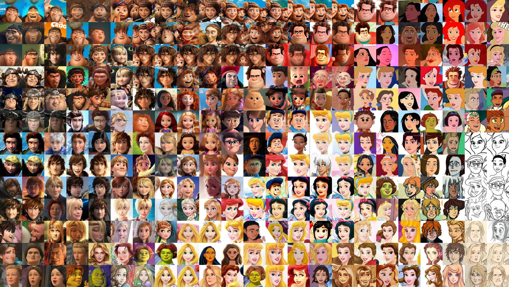
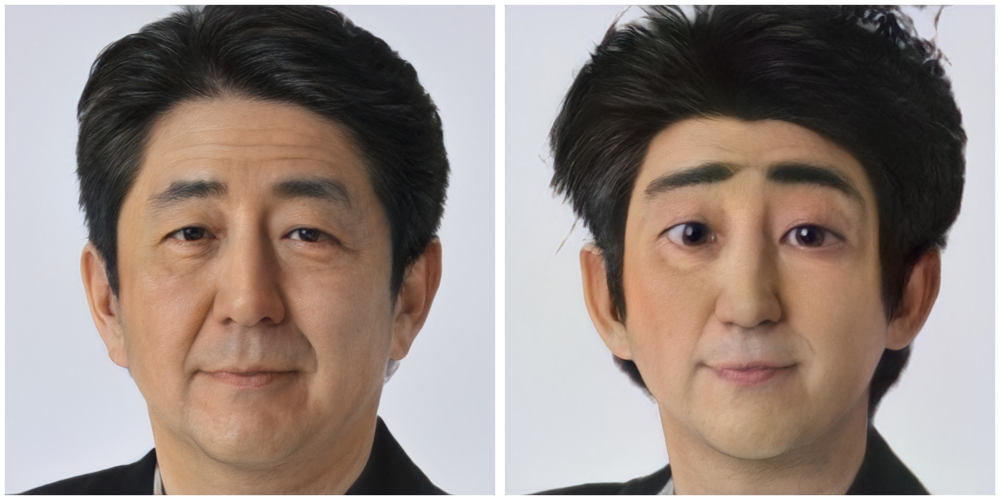

# Toonify

Repository accompanying the paper:

## Resolution Dependent GAN Interpolation for Controllable Image Synthesis Between Domains

Accepted to the [Neurips 2020 Machine Learning for Creativity and Design
NeurIPS 2020 Workshop](https://neurips2020creativity.github.io/). 

## Datasets

Datasets used in the paper:

### Aligned Ukiyo-e Faces

Over five thousand aligned ukiyo-e faces at 1024x1024 pixel resolution. The dataset is released under a CC BY-SA 4.0 license. For more details see the accompanying [dataset release blog post](https://www.justinpinkney.com/ukiyoe-dataset/).

[Download here - V2 (Google Drive)](https://drive.google.com/file/d/1zEgVLrKVp8oCZuX0NENcAeh-kdaKJzNG/view?usp=sharing)

### Cartoon Faces

[Download here (Mega)](https://mega.nz/file/HslSXS4a#7UBanJTjJqUl_2Z-JmAsreQYiJUKC-8UlZDR0rUsarw)

## Code

I'm working on releasing an end to end set of examples but in the mean time please see the following two Colab notebooks:

- [Network blending](StyleGAN-blending-example.ipynb)  - Demonstrates the layer swapping technique for resolution dependent GAN interpolation 
- [Toonify yourself](toonify-yourself.ipynb)  - Recreates the right hand panel of Figure 3 from the paper

## More

For more details also see these blog posts:

- https://www.justinpinkney.com/stylegan-network-blending/
- https://www.justinpinkney.com/toonify-yourself/
- https://www.justinpinkney.com/making-toonify/

While you're here why not [Toonify Yourself](https://toonify.photos/original) you can also try out [Toonify HD](https://toonify.photos)
